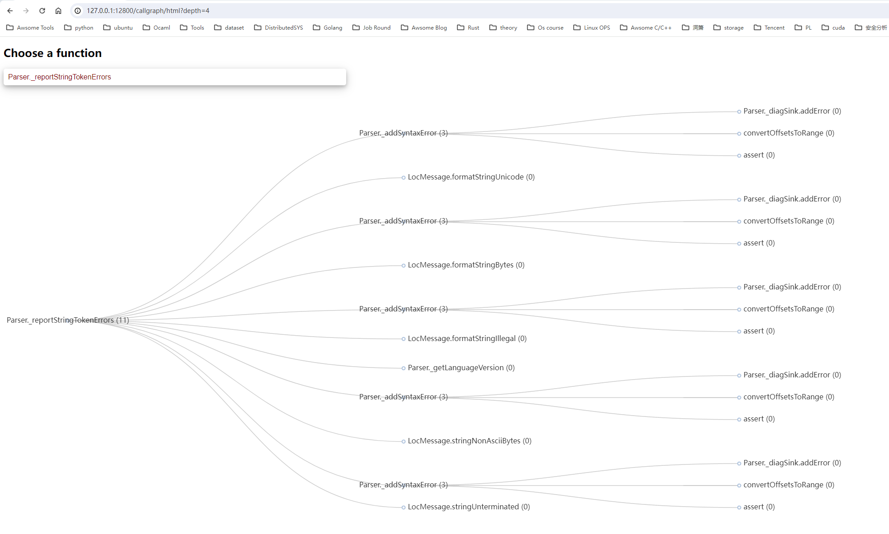
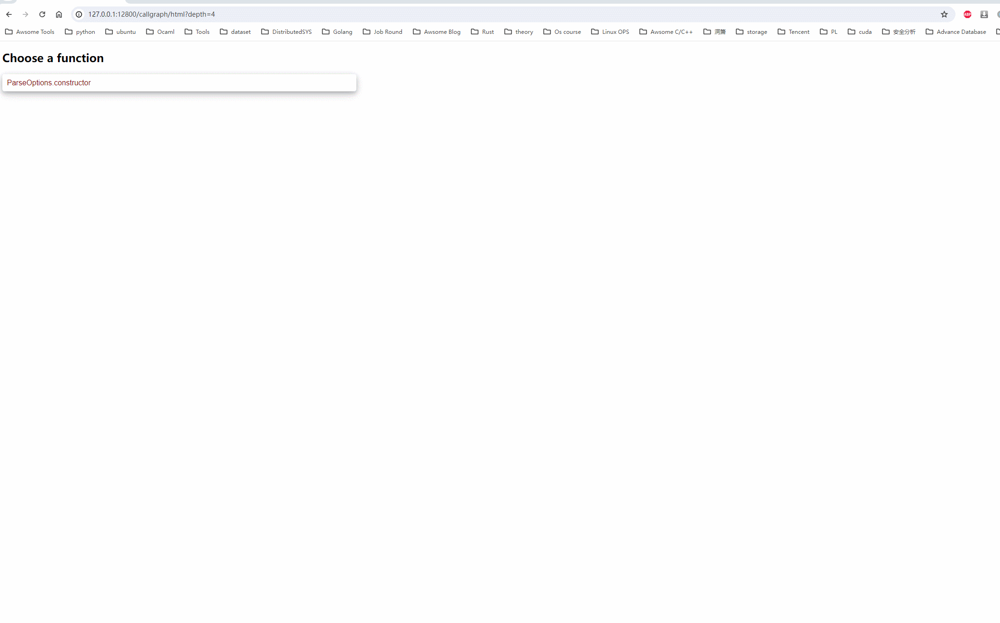

# callgraph

## Usage

1. run graphgen on your project source directory.

```shell
graphgen --listen-addr 127.0.0.1:12800
```

2. open `http://127.0.0.1:12800/callgraph/html?depth=4` 
3. choose a function to draw callgraph.

- screenshot:



- usage gif:


## Todo

- [x] supports `typescript` (completed)
- [ ] supports `Java`、`Golang`
